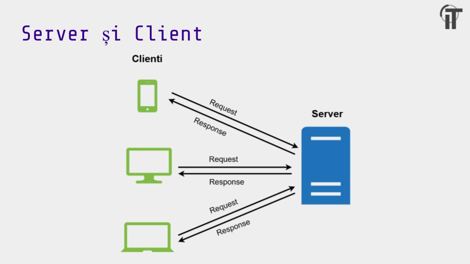

# Getting started with backend

## Tehnologii recomandate
- [Postman](https://www.postman.com/downloads/)
- [MongoDB Compass](https://www.mongodb.com/try/download/compass)
- [Express](https://expressjs.com/en/starter/installing.html)
- [Mongoose](https://mongoosejs.com/docs/guide.html)
- [JsonWebToken](https://www.npmjs.com/package/jsonwebtoken)
- **Bonus** - [Multer](https://www.npmjs.com/package/multer)

## Overview backend
- Backend-ul se refera la crearea de cod care ruleaza pe server

- Ca si atributii de baza avem: 
  - sa stocam date
  - sa validam datele primite de la clienti
  - sa transformam datele in informatie utila
- O aplicatie de backend ruleaza la infinit si primeste toate request-urile trimise catre server
- In functie de datele request-ului el executa o anumita actiune
## Node.js
- Node.js este un engine care ne permite sa rulam cod de javascript in afara browserului

- El adauga si niste biblioteci standard pentru a putea realiza actiuni generale pentru aplicatii server-side(networking, lucru cu fisiere, lucru cu procese, etc)
  
## Express
- Insa pentru ca de la prea mult lucrat cu biblotecile standard de Node.js iti cade creierul in ciorba vom folosi Express
- Express este o librarie de backend care ne permitem sa facem mai usor partea de **routing**
- Pentru alte actiuni cum ar fi lucrul cu sistemul de fisiere sau cu alte procese vom folosi tot bibliotecile standard de Node.js

## Request-uri si Response-uri

- Explicatie:
  -  **Verbul**: tipul de actiune pe care vrem sa o realizam(cele mai folosite verbe sunt **GET, POST, PATCH, DELETE**)
  -  **Path**: o locatie pe care o folosim sa identificam o anumita resursa
  -  **Headers**: alte metadate pe care le putem folosi in diferite feluri(e.g. sa verficam daca un user este autentificat)
  -  **Body**: date pe care clientul le poate trimite catre server(e.g. informatii despre un user pe care vrem sa il cream)


- Explicatie:
  - **Status**: rezultatul operatiei pe care vrem sa o realizam. Cateva status-uri importante sunt:
    - 200 - totul e ok
    - 404 - nu am gasit resursa cautata
    - 400 - datele request-ului nu sunt bune
    - 401 - neautorizat
    - 403 - nu ai drepturi sa faci o actiune
    - 500 - o problema la aplicatia de backend
 -  **Headers**: alte metadate pe care le putem folosi in diferite feluri
  -  **Body**: date pe care server-ul le poate trimite catre client(e.g. datele unui user pe care il cautam) 
## Routing
- Prin routing intelegem actiunea de a executa o anumita functie pentru anumite tipuri de request-uri
- In general identificam un tip de request dupa verb si un path
- Exemplu:
```Javascript
// request cu verbul get si path-ul /users
app.get("/users", /*parametru care nu ne intereseaza*/)

// request cu verbul get si path-ul /posts/create/123
app.post("/posts/create/123", /*parametru care nu ne intereseaza*/)
```
- Fiecare ruta pe care o definim(codul de deasupra) este un apel de functie care ii spune Express-ului ca pentru un request(adica verb + path) executa un **handler** 
- Un **handler** este o functie care primeste ca parametrii request-ul si response-ul pe care il intercepteaza server-ul
- Acest request si response care vine ca parametru nu este nimic mai mult decat un obiect care retine datele prezentate mai sus(headers, body, path, verb, dar si altele)
- Exemplu: 
```Javascript
// request cu verbul get si path-ul /users
app.get("/users", (request, response) => {
  console.log(req.path);
  console.log(req.headers);
  console.log(req.body);

  response.status(200).send("Raspuns de la server")
})
```

- In exemplul asta afisam datele request-ului nostru si trimitem inapoi un raspuns cu statusul **200** si cu body-ul **"Raspuns de la server"**

## Baze de date
- Am vazut cum putem realiza o actiune pentru un anumit tip de request, dar acum intrebarea este ce executam in handler?
- Well, cum am zis la inceput unul din rolurile aplicatiei noastre de backend este sa stocheze date
- In general, pentru datele respective avem nevoie de cateva actiuni simple: sa accesam datele, sa putem crea date noi, sa stergem datele si sa le updatam
- Pentru asta folosim un **sistem de baze de date**, in cazul nostrui MongoDB

### [MongoDB](https://www.mongodb.com/home)
- MongoDB este un sistem de baze de date care ne permite sa avem datele retinute ca **documente** care nu au o structura exacta
- Aceste documente sunt grupate in **colectii**
- Exemplu de document:


### Mongoose
- Pentru a putea lucra cu baza de date mai usor o sa folosim o biblioteca numita [mongoose](https://mongoosejs.com/docs/guide.html)
- Mongoose ne ajuta cu 2 lucruri:
  - Sa facem o **schema**(o structura) dupa care aplicatia noastra va crea anumite obiecte
  - Sa facem actiuni(queries) asupra bazei de date: `find`, `save`, `findById`, `delete`, `update`

- Exemplu schema: 
```Javascript
  // Structura pe care o vor avea obiectele in baza de date
  const TodoSchema = new mongoose.Schema ({
    message: { type: String, required: true },
    done: { type: Boolean, required: true }
});

  // Modelul pe care il vom folosi in aplicatia noastra ca sa folosim baza de date
  const Todo = mongoose.model("Todo", TodoSchema);

```
- Exemplu queries: 

```Javascript
  // Folosim schema de mai sus
  const Todo = mongoose.model("Todo", TodoSchema);

  // luam toate resursele din baza de date
  const allTodos = Todo.find({});
  
  // luam o anumita resursa din baza de date pe baza unui id
  const todoWithId1 = Todo.findById({_id: 1});

  // facem un obiect nou pe care sa il stocam in baza de date
  const newTodo = new Todo({
    message: "mesaj",
    done: true
  })
  newTodo.save();

  // updateaza obiectul cu id-ul id si ii modifica valoarea message
  const todo = Todo.updateOne({ id }, { $set: { message: message } });

  // sterge obiectul cu id-ul id
  Todo.findByIdAndDelete(id)
```

## JsonWebToken
- In general ca sa trimitem/primim  informatii de la client la server folosim formatul [JSON(JavaScript Object Notation)](https://www.json.org/json-en.html)
- Exemplu JSON:
```JSON
{
  "name": "Codrut",
  "status": "Idiot, dar asumat",
  "age": 20
}
```
- Daca in schimb vrem sa trimitem date sensibile pe care nu am vrea sa le vada oricine sau date pe care nu am vrea sa le modificam putem folosi un [JSON Web Token](https://jwt.io/)
- In general o sa generam un JWT atunci cand un user se autentifica
- De fiecare data cand se va face un request catre server se va trimite alaturi si un JWT in header
- Pe partea de backend noi vom verifica autenticitatea token-ului si vom verifica ca user-ul are drepturi de access la resursa ceruta
- Libraria folosita([jsonwebtoken](https://www.npmjs.com/package/jsonwebtoken)) ne pune la dispozitie 2 functii importante:
  - `sign` - pentru a genera un token pe baza unui JSON
  - `verify` pentru a verifica ca token-ul este valid
- Acest token este semnat(adica este folosit un string pe care doar server-ul il are in crearea token-ului), iar semnatura este verificata in verify
- Exemplu: 
```Javascript
  // sign returneaza un string(token-ul nostru) si primeste ca parametru un json si un string(semnatura)
  const token = jwt.sign(some_json, signature);
  
  //verify returneaza obiectul decodat si primeste ca parametru un token si semnatura
  const data = jwt.verify(token, process.env.JWT_SECRET);
```