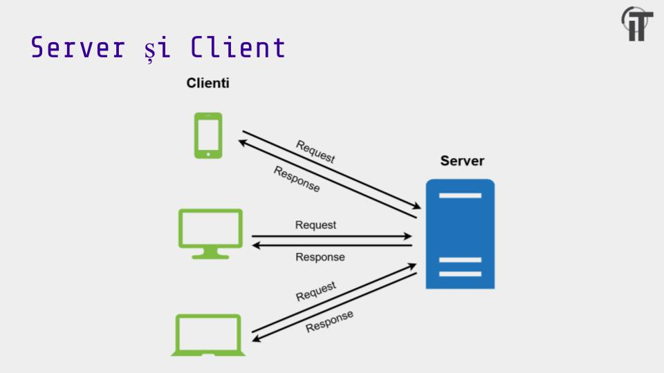
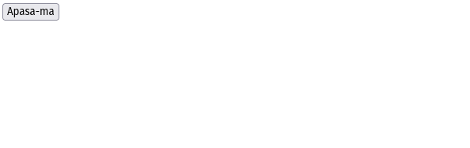

# Getting started with frontend

## Tehnologii recomandate
- [React](https://www.youtube.com/watch?v=FRjlF74_EZk)
- [React Bootstrap](https://react-bootstrap.github.io/getting-started/introduction/)

## Overview pentru frontend
- Frontend-ul se refera la crearea de cod care sa ruleze la nivelul clientilor

- Ca si atributii de baza avem: 
  - sa afisam datele primite de la backend
  - sa oferim interfete grafice pe care utilizatorii sa le foloseasca 
  - sa trimitem date catre backend
- Pentru a putea sa facem toate aceste lucruri o sa folosim:
  - HTML -> pentru a defini structura paginii
  - CSS -> pentru stilizare
  - Javascript -> pentru a defini actiuni sau logica in general

## Javascript
- Javascript-ul este un limbaj de programare care poate rula atat in browser, cat si ca program in sine(prin engine-uri precum Nodejs)
- Cateva lucruri de baza pe care le vom folosi mai incolo pentru pagini sunt: 
  - variabile
  ```Javascript
    let a; // variabila care poate fi modificata dupa ce a fost initializata
    
    const b; // variabila care nu poate fi modificata dupa initializare
  ```
  - **In Javascript nu avem tipuri de date!**
  - functii
  ``` Javascript
    // o functie normala
    function func() {

    }
    
    // functiile pot fi definite si ca variabile
    const func = () => {

    }

    // ambele exemple sunt echivalente si in ambele cazuri pentru a apela functia vom folosi sintaxa:
    func();
  ```
  - sintaxa: ```() => {}``` se numeste [arrow function](https://www.w3schools.com/js/js_arrow_function.asp) si este acelasi lucru ca o functie normala, dar are avantajul ca poate fi folosita mai usor cand nu avem nevoie sa refolosim o functie(o sa discutam mai tarziu despre asta)
  - lucrul cu array-uri
  ```Javascript
    // definim un array
    let arr = [1, 2, 3, 4];

    // aici afisam toate elementele vectorului
    // forEach este folosit pentru a parcurge un vector
    // iar pentru ca forEach primeste ca parametru o functie, o sa folosim un arrow function pentru a face afisarea
    arr.forEach(x => console.log(x));

    // map este folosit pentru a transforma fiecare element al unui vector in altceva pe baza unei functii
    // in cazul asta vectorul intors de map va fi: [2, 4, 6, 8]
    let arrTimes2 = arr.map(x => x * 2);
  ```

## React
- React este un framework de Javascript pe care il folosim pentru a putea scrie partea de logica a aplicatiei mai usor
- Idea de baza din spatele React este cea de impartire si modularizare a codului
- Pentru asta avem componente

### Componente
- O componenta de react nu este nimic mai mult de o functie care intoarce o bucata de HTML
- Exemplu componenta:
#### **`ButonBazat.js`**
``` Javascript
function ButonBazat() {
	return (
		<div>
			<button>Apasa-ma</button>
		</div>
	)     
}
```
- asta e un exemplu foarte simplu de componenta si daca vrem sa o afisam obtinem


### Stilizare
- Mai tarziu in acest material o sa vorbim despre o librarie care ne poate ajuta foarte mult cu stilizarea(react-bootstrap)
- Dar in cazul in care vrem sa aduagam stilizare custom pentru componentele noastre putem folosi css
- Exemplu:
#### **`button.css`**
``` CSS
.my-btn {
  background-color: #6f3096;
  color: #ffffff;
  border-radius: 5px;

  font-family: 'Merriweather';
  font-style: normal;
  font-weight: 700;
  font-size: 16px;
  line-height: 20px;

  text-align: center;
  padding: 2%;
}
```

#### **`ButonBazat.js`**
``` Javascript
import './button.css';

function ButonBazat() {
	return (
		<div>
			<button className="my-btn">Apasa-ma</button>
		</div>
	)     
}
```
- Rezultat:


### HTML + JS = LOVE
- Exemplele de mai sus ne aratau cum putem sa facem o simpla componenta sa fie afisata pe ecran
- Daca in schimb logica noastra este mai complexa putem imbina codul de HTML cu cod de Javascript in care sa implementam instructiuni conditionale sau repetitive pe baza altor variabile din codul 
componentei
- Folosim ```{}``` pentru a marca ca intre acolade este cod de JS si ```()``` pentru a marca ca intre paranteze se afla cod de HTML

- Exemplu **if**: 
#### **`ButoaneIf.js`**
``` JSX
function ButonBazat() {
	let x = 7;

	return (
		<div>
			{
				x % 2 == 0 ?
				(<button className="my-btn">Apasa-ma</button>) :
				(<p>Butonul nu este afisat</p>)
			}
		</div>
	)     
}
```
- Aici sintaxa dubioasa ```condtiei ? rezultat1 : rezultat2``` este folosita in loc de **if-else**
- Daca conditia se respecta va fi intors primul rezultat altfel va fi intors al doilea

- Exemplu **for**:
``` Javascript
function ButonBazat() {
	let x = [7, 9, 5, 8, 3];

	return (
	<div>
		{
			x.map(value => (
				<button className="my-btn">{value}</button>
			))
		}
	</div>
	)     
}
```
- Nu putem sa iteram direct prin fiecare element al unui array si nici nu am avea nevoie de asa ceva in codul de html in care vrem sa afisam ceva
- Pentru situatii in care nu vrem sa afisam cod de html trebuie sa executam codul in afara instructiunii return
- Pentru codul de html intors de componenta vom folosi mereu **map**

### Props
- 