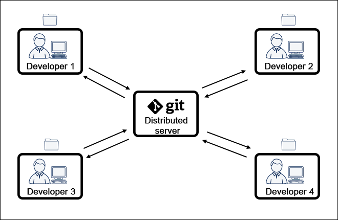

# How-To-Git

## Overview
- Git-ul este un sistem de versionare 
- Acesta este folosit pentru a distribui cod si a lucra mai eficient in echipe
- El este compus din 2 componente:
    - un repository local -> care este folderul in care lucrezi si in care se afla codul tau
    - un repository remote -> in care codul vostru va fi pastrat

## Github
- [Githbu](https://github.com/) este platforma in care vom stoca toate repository-urile remote pe care le avem
- dupa ce va faceti cont va trebui sa va creati un nou repository
  

